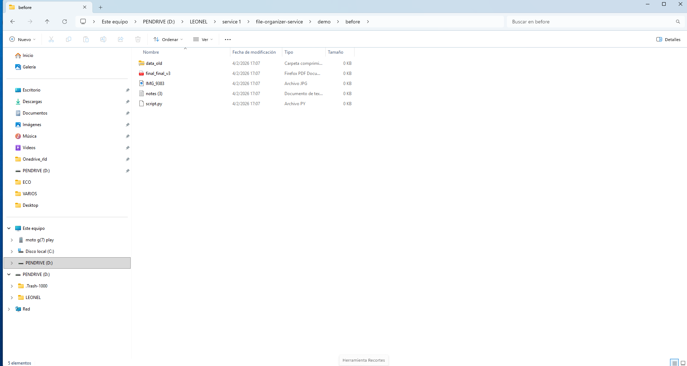
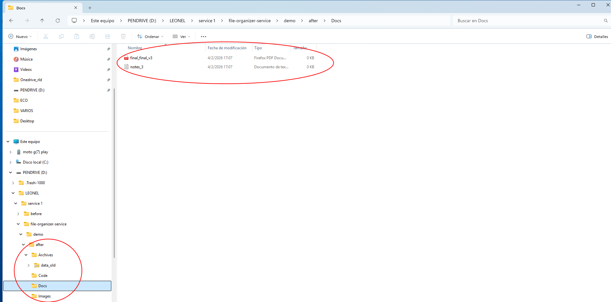

# 📁 Folder Cleanup & Structuring (Python)

Organize messy folders into a clean structure using configurable rules.

This tool sorts files into folders (Images, Docs, Archives, Code, etc.) based on file extensions defined in `rules.json`. It supports safe preview mode, copy mode, and in-place organization.

---

## ✅ What it does

- Sorts files into categorized folders
- Uses configurable rules from `rules.json`
- Handles unknown file types automatically
- Optional renaming for consistency
- Supports dry-run before applying changes

---

## ▶️ Usage

### 1) Dry-run (recommended first step)

Preview what would happen without moving files:

```bash
python3 organize.py /path/to/source --rules rules.json --output /path/to/output --dry-run --rename
```

### 2) Copy mode (safe apply)

Creates organized structure in a new folder, leaving original untouched:

```bash
python3 organize.py /path/to/source --rules rules.json --output /path/to/output --rename
```

### 3) In-place organization

Moves files directly inside the original folder:

```bash
python3 organize.py /path/to/source --rules rules.json --rename
```

---

## ⚙️ Rules Configuration

File categorization is controlled by `rules.json`.

Example categories include:

- Images
- Videos
- Audio
- Documents
- Spreadsheets
- Slides
- Archives
- Code

Unknown extensions are placed in the `Other` folder.

You can edit `rules.json` to customize folder names and extensions.

---

## 📸 Example

**Before**



**After**



---

## 📋 Requirements

- Python 3.8+

