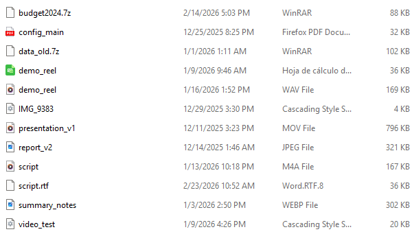
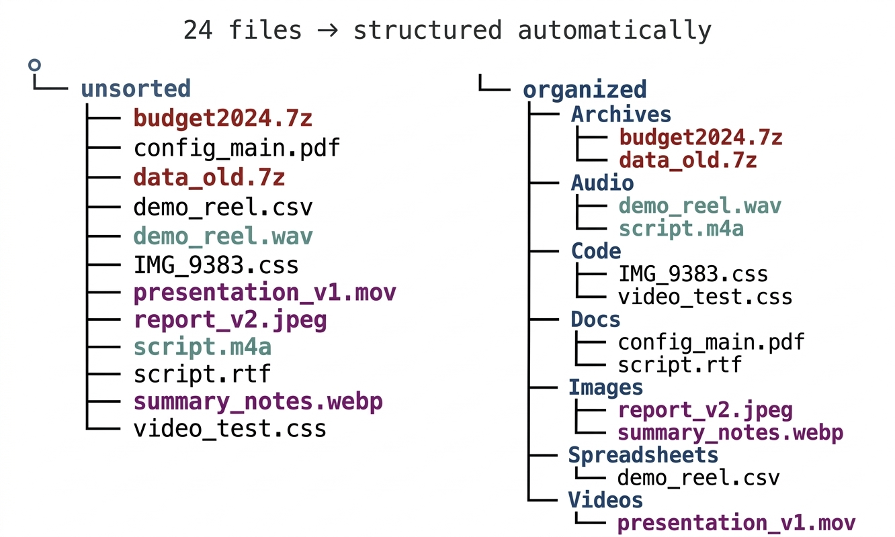

# Folder Cleanup and Structuring (Python)

Turn messy folders into a clean, client-ready file structure.

## Overview

This service organizes mixed files into consistent category folders (Images, Docs, Archives, Code, etc.) using rules from `rules.json`.

## Visual Schema

```text
+-----------------------------+
| Source Folder (Mixed Files) |
+-----------------------------+
              |
              v
+-----------------------------+
| Rule Mapping (rules.json)   |
+-----------------------------+
              |
              v
+-----------------------------+
| Sort + Rename Engine        |
+-----------------------------+
              |
              v
+-----------------------------+
| Organized Output Folders    |
| Images / Docs / Code / etc. |
+-----------------------------+
```

## Requirements

- Python 3.9+

## Installation

```bash
pip install -r requirements.txt
```

## Usage

### Quickstart (dry-run)

```bash
python3 folder_organizer.py /path/to/source --rules rules.json --output /path/to/output --dry-run --rename
```

### Apply in copy mode

```bash
python3 folder_organizer.py /path/to/source --rules rules.json --output /path/to/output --rename
```

### Apply in-place

```bash
python3 folder_organizer.py /path/to/source --rules rules.json --rename
```

## Input

- Folder to organize (`root`)
- Rule mapping file (`--rules`, default: `rules.json`)
- Optional destination folder (`--output`)
- Optional behavior flags (`--dry-run`, `--rename`)

## Output

- Organized category folders in the `--output` folder (copy mode), or in the source folder itself (in-place mode)
- Run log: `logs/organize_log_<source>_to_<output>_<timestamp>.txt`

## Example

**Before**



**After**



## Use Cases

- Cleaning mixed client/project folders
- Preparing professional delivery packages
- Standardizing archives before handoff

## Notes

- Use copy mode first when you want a safe previewable delivery pipeline.
- Copy mode requires an empty output folder.
- Files already inside recognized top-level category folders are skipped.

## License

MIT License. See `LICENSE`.
